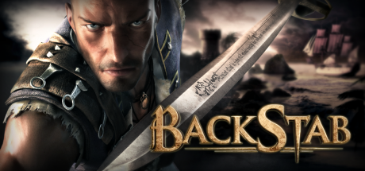

<h1 align="center">
<br>
Backstab HD · PSVita Port
</h1>
<p align="center">
  <a href="#setup-instructions-for-players">How to install</a> •
  <a href="#controls">Controls</a> •
  <a href="#known-issues">Known Issues</a> •
  <a href="#build-instructions-for-developers">How to compile</a> •
  <a href="#credits">Credits</a> •
  <a href="#license">License</a>
</p>

Backstab is a 2011 adventure game for iOS and Android devices.
Take on the role of Henry Blake, a broken man whose life was stripped away,
and help in his quest for justice and revenge. Climb, jump and sneak your way
through diverse settings to reach your target and strike down adversaries.
Use your deadly fighting skills and the combo-based combat system to defeat
your nemesis and anyone else who gets in your way.

This repository contains a loader of **the Android release of Backstab HD v1.2.8d**,
based on the [Android SO Loader by TheFloW][gtasa]. The loader provides
a tailored, minimalistic Android-like environment to run the official ARMv7
game executable on the PS Vita.

Disclaimer
----------------

**Backstab HD** is copyright © 2014 Gameloft. All rights reserved.
Gameloft, the Gameloft logo and Backstab are trademarks of Gameloft
in the U.S. and/or other countries.

The work presented in this repository is not "official" or produced or sanctioned by
the owner(s) of the aforementioned trademark(s) or any other registered trademark
mentioned in this repository.

This software does not contain the original code, executables, assets, or
other non-redistributable parts of the original game product. The authors of
this work do not promote or condone piracy in any way. To launch and play
the game on their PS Vita device, users must possess their own legally obtained
copy of the game in form of an .apk file.

Setup Instructions (For Players)
----------------

In order to properly install the game, you'll have to follow these steps
precisely:

- (Recommended) Make sure that you are either on 3.60 enso or 3.65 enso firmware
  version. Other versions may work too, but no support are provided for them! If
  you experience any issues apart from described in the
  <a href="#known-issues">Known Issues</a> section, please upgrade or downgrade
  your firmware before asking for support.

- Install or update [kubridge][kubridge] and [FdFix][fdfix] by copying
  `kubridge.skprx` and `fd_fix.skprx` to your taiHEN plugins folder
  (usually `ur0:tai`) and adding two entries to your `config.txt` under `*KERNEL`:

```
  *KERNEL
  ur0:tai/kubridge.skprx
  ur0:tai/fd_fix.skprx
```

```diff
! ⚠️ Don't install `fd_fix.skprx` if you're using the rePatch plugin!
```

- Make sure you have `libshacccg.suprx` in the `ur0:/data/` folder on your
  console. If you don't, use [ShaRKBR33D][shrkbrd] to get it quickly and easily.

- <u>Legally</u> obtain your copy of BackStab HD for Android in a form
  of an `.apk` file and data files. This port is tailored for v1.2.8d (latest)
  version of the game. Other versions may work too but no support is provided
  for them.

    - If you have it installed on your phone, you can
      [get all the required files directly from it][unpack-on-phone]
      or by using any APK extractor you can find on Google Play.

> ℹ️ Verify that your build is the correct one using **sha1sum** (can also
> be found as an online tool). sha1sum for `lib/armeabi-v7a/libPirates.so`
> **must** be `9a36ce92ac09f2908c155ab1debb3e138a3496b8`

- Open the `.apk` with any zip explorer (like [7-Zip](https://www.7-zip.org/))
  and extract the file `lib/armeabi-v7a/libPirates.so` from the `.apk` into
  `ux0:data/backstab/` on your Vita. Example of correct resulting path:
  `ux0:data/backstab/libPirates.so`

- Fetch the game data files from your device. You can find them at
  `/sdcard/gameloft/games`. Copy the `com.gameloft.android.ANMP.GloftSDHM`
  folder to `ux0:data/backstab/` on your Vita.
  Example of correct resulting path: `ux0:data/backstab/com.gameloft.android.ANMP.GloftSDHM/files/actors.gla`

- Install `BackstabHD.vpk` (from [Releases][latest-release]).

- **IMPORTANT:** when you launch the game for the first time, open the in-game
  settings (cogwheel icon in main menu), and do two things:
    - Reduce controls sensitivity to minimum.
    - In "Control Scheme", select **Control Scheme 2**.

- (Optional) Tap **Settings** in the bottom left corner of the port's LiveArea
  to adjust some settings. Namely, you can change analog sticks dead zones,
  change graphical detail level, and enable FPS limiter.

Controls
-----------------

|       Button        | Action                                                     |
|:-------------------:|:-----------------------------------------------------------|
| ![joysl] / ![dpadh] | Move                                                       |
|      ![joysr]       | Control camera                                             |
|      ![trigl]       | Aim Mode                                                   |
|      ![trigr]       | Fire / Special attack (when prompted in combat)            |
|      ![cross]       | Jump / Sheathe sword                                       |
|      ![circl]       | Counter-attack (when prompted in combat)                   |
|      ![squar]       | Attack                                                     |
|      ![trian]       | Interact / Switch ranged weapon (when aiming)              |
|   ![trian] (Hold)   | Call horse (only on some locations)                        |
| ![trigr] + ![squar] | "Vengeance" mode (when prompted in combat)                 |
|      ![selec]       | Open Map                                                   |
|      ![start]       | Open Menu                                                  |
|     Touchscreen     | Menus control. Please don't try to use buttons or analogs  |

Known Issues
----------------

1. On first levels, sometimes a loss of some sound (random, could be some of sfx,
music or dialogue) may occur. Most likely, can not be fixed.
2. Starting a new game over an old save loads the old save instead. If you're
out of slots, you'll have to remove save files manually from the data folder.

Build Instructions (For Developers)
----------------

In order to build the loader, you'll need a [vitasdk](https://github.com/vitasdk)
build fully compiled with softfp usage. The easiest way to obtain one is
following the instructions on https://vitasdk.org/ while replacing the URL in
this command:
```bash
git clone https://github.com/vitasdk/vdpm
```
Like this:
```bash
git clone https://github.com/vitasdk-softfp/vdpm
```

All the required libraries should get installed automatically if you follow the
installation process from https://vitasdk.org/.

One thing you'll need to recompile by hand is [VitaGL](https://github.com/Rinnegatamante/vitaGL).
Use the following flags:
```bash
make LOG_ERRORS=1 SOFTFP_ABI=1 SAFE_DRAW=1 HAVE_GLSL_SUPPORT=1 -j$(nproc) install
```

After all these requirements are met, you can compile the loader with the
following commands:

```bash
cmake -S. -Bbuild -DCMAKE_BUILD_TYPE=Debug # Or =Release if you don't want debug logging
cmake --build build -j$(nproc)
```

Also note that this CMakeLists has two "convenience targets". While developing,
I highly recommed using them, like this:
```bash
cmake --build build --target send # Build, upload eboot.bin and run (requires vitacompanion)
cmake --build build --target dump # Fetch latest coredump and parse
```

For more information and build options, read the [CMakeLists.txt](CMakeLists.txt).

Credits
----------------

- [Andy "The FloW" Nguyen][flow] for the original .so loader.
- [Rinnegatamante][rinne] for a lot of work he did with VitaGL specifically to make this port
possible, Audio Player code, and many other great things.
- [CatoTheYounger][cato] for **tremendous** amount of testing. Not the hero we
  deserved, but the one we need.
- [Once13One][o13o] for his beautiful LiveArea assets.
- Dieter B., CatoTheYounger, Arka Mukherjee, Edgar Morales, Sergey Galdin:
  my dearest [Patrons](https://patreon.com/gl33ntwine/).

License
----------------

This software may be modified and distributed under the terms of
the MIT license. See the [LICENSE](LICENSE) file for details.

[cross]: https://raw.githubusercontent.com/v-atamanenko/sdl2sand/master/img/cross.svg "Cross"
[circl]: https://raw.githubusercontent.com/v-atamanenko/sdl2sand/master/img/circle.svg "Circle"
[squar]: https://raw.githubusercontent.com/v-atamanenko/sdl2sand/master/img/square.svg "Square"
[trian]: https://raw.githubusercontent.com/v-atamanenko/sdl2sand/master/img/triangle.svg "Triangle"
[joysl]: https://raw.githubusercontent.com/v-atamanenko/sdl2sand/master/img/joystick-left.svg "Left Joystick"
[joysr]: https://raw.githubusercontent.com/v-atamanenko/sdl2sand/master/img/joystick-right.svg "Left Joystick"
[dpadh]: https://raw.githubusercontent.com/v-atamanenko/sdl2sand/master/img/dpad-left-right.svg "D-Pad Left/Right"
[dpadv]: https://raw.githubusercontent.com/v-atamanenko/sdl2sand/master/img/dpad-top-down.svg "D-Pad Up/Down"
[selec]: https://raw.githubusercontent.com/v-atamanenko/sdl2sand/master/img/dpad-select.svg "Select"
[start]: https://raw.githubusercontent.com/v-atamanenko/sdl2sand/master/img/dpad-start.svg "Start"
[trigl]: https://raw.githubusercontent.com/v-atamanenko/sdl2sand/master/img/trigger-left.svg "Left Trigger"
[trigr]: https://raw.githubusercontent.com/v-atamanenko/sdl2sand/master/img/trigger-right.svg "Right Trigger"

[gtasa]: https://github.com/TheOfficialFloW/gtasa_vita
[kubridge]: https://github.com/bythos14/kubridge/releases/
[fdfix]: https://github.com/TheOfficialFloW/FdFix/releases/
[unpack-on-phone]: https://stackoverflow.com/questions/11012976/how-do-i-get-the-apk-of-an-installed-app-without-root-access
[shrkbrd]: https://github.com/Rinnegatamante/ShaRKBR33D/releases/latest
[latest-release]: https://github.com/v-atamanenko/backstab-vita/releases/latest
[issue]: https://github.com/v-atamanenko/backstab-vita/issues/new
[dsmotion]: https://github.com/OperationNT414C/DSMotion/releases
[ds4touch]: https://github.com/MERLev/ds4Touch/releases

[flow]: https://github.com/TheOfficialFloW/
[rinne]: https://github.com/Rinnegatamante/
[bythos]: https://github.com/bythos14/
[cato]: https://github.com/CatoTheYounger97/
[o13o]: https://github.com/once13one/
